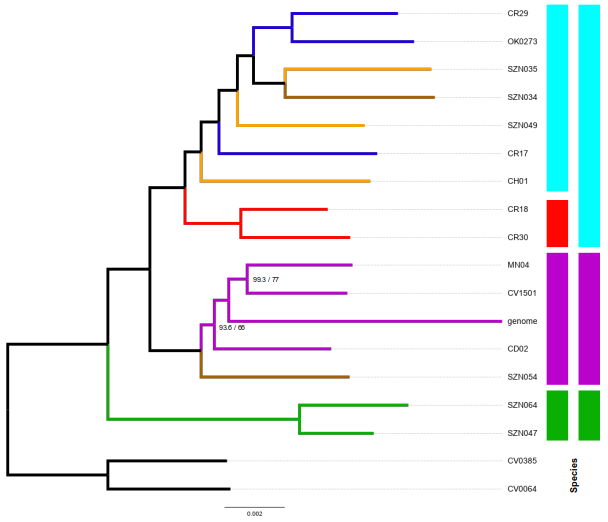

## Species delimitation
The program selected to test species delimitation hypotheses was [BPP](https://github.com/bpp/bpp). This program requires all specimens to be assigned to a putative species, and then tests if these species can be considered *real*. Because the null hypothesis is that all speciens belong to the same species *L. ventricosus*, we assigned the specimens to the clades recovered in the mitochondrial tree. The only exception is the brown clade, that we now know it likely is an artifact.

Instead of analyzing all the genes, we created five independent datasets with 50 randomly selected genes each. These subsets were concatenated into the supermatrices: **Lventricosus.Supermatrix1.phy**, **Lventricosus.Supermatrix2.phy**, **Lventricosus.Supermatrix3.phy**, **Lventricosus.Supermatrix4.phy**, **Lventricosus.Supermatrix5.phy**. Thus far, four different analyses were run:
<ul>
  <li>A10 + Algorithm 0</li>
  <li>A10 + Algorithm 1</li>
  <li>A11 + Algorithm 0</li>
  <li>A11 + Algorithm 1</li>
</ul>

A10 runs species delimitation with a user-specific tree, whereas A11 infers the tree topology and then performs species delimitation. Thus far, algorithms 0 and 1 change the way that new theta parameters are proposed.

## BPP analysis
Here, I provide the five supermatrices, the imap file, and the four control files needed to replicate the analyses. Please, note that you need probably need to change the root to the input files and the seeds (we used **12345** and **54321** for chains 1 and 2).

To run BPP, simply type:

    bpp --cfile Lventricosus.bpp.A10.algorithm0.ctl
    bpp --cfile Lventricosus.bpp.A10.algorithm1.ctl
    bpp --cfile Lventricosus.bpp.A11.algorithm0.ctl
    bpp --cfile Lventricosus.bpp.A11.algorithm1.ctl

## What was the result?
It turns out BPP could not return a confident number of species. Apparently the signal in the data is mixed, and BPP would propose three or four species depending on the supermatrix analysed. You can see the two proposed species delimitation hypotheses in the figure below. Based on these results, **we propose to describe three species within the *L. ventricosus* species complex**, and a forth one (the red clade) pending on further analyses with an extended sampling.

Modified version of Fig. 3.
 
---
