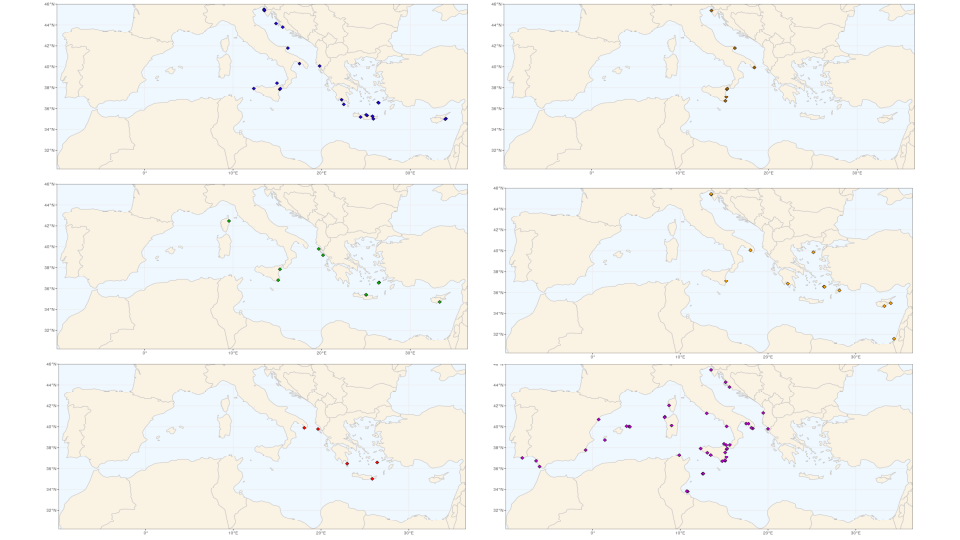

## Distribution maps
This directory contains the data (**Lautoconus ventricosus.Map.kml**) and the R script (**Create_map.R**) to draw all the maps presented in the manuscript. The sampling points were mapped in Google Earth and then exported.

## How do the maps look like?

Supplementary Material Figure 2.

---
