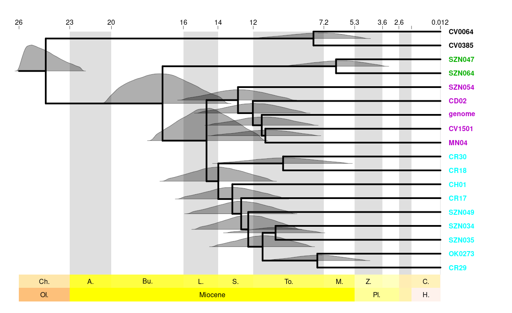

## Estimation of diversification times
MCMCTree was used to estimate the diversification times of the main lineages within the *L. ventricosus* species complex. This program can be downloaded within [PAML](http://abacus.gene.ucl.ac.uk/software/paml.html). This is the first time I use this program, so I have followed several tutorials to help me go through it:
<ul>
    <li><a href="https://github.com/sabifo4/BayesianInference_practicals/tree/main/practical_sessions/day2/01_MCMCtree">Phylogenomics course (PHYSALIA) - practical sessions for Bayesian inference</a>. I particularly recommend this one, written by Sandra Álvarez-Carretero.</li>
    <li><a href="http://abacus.gene.ucl.ac.uk/software/MCMCtree.Tutorials.pdf">MCMCTree Tutorials</a>, written by Mario dos Reis, Sandra Álvarez-Carretero and Ziheng Yang.</li>
    <li><a href="https://dosreislab.github.io/2021/03/29/mcmctree-help.html">Help, my MCMCtree analysis doesn't work!</a>, by Mario dos Reis.</li>
</ul>

### Node calibrations
The same three calibration points were used in the mitochondrial and nuclear tree inferences. Additionally, a forth one was included in the mitochondrial analysis because dating the root is a requirement of the program (dates are in million years, My). Secondary calibrations are extracted from [Abalde et al. (2017), BMC Evol Biol](https://bmcecolevol.biomedcentral.com/articles/10.1186/s12862-017-1069-x):

| Calibration | Node | Time range (My) | Description |
|:---:| --- |:---:| --- |
| 1 | *Africonus* - *Lautoconus* | 20 - 28 | *Africonus* is endemic to Cabo Verde, where the oldest island, Sal, is at most 28 My old. Plus, the lower end is based on previous knowledge |
| 2 | *L. ventricosus* | 10 - 20 | The oldest fossil of this species comes from the Upper-Middle Miocene, and it cannot be older than the previous node |
| 3 | *A. crotchii* - *A. maioensis* | 0.5 - 2 | This is a secondary calibration |
| 4 | *Kalloconus* - *Varioconus* | 30 - 40 | This node is calibrated only in the mitochondrial tree. It is set as a uniform distribution based on previous estimates |

### Preparation of input data
MCMCTree needs to be fed a tree topology, so we first inferred this using [IQ-TREE](http://www.iqtree.org/) under the the HKY+G4 model and the same matrices that we'll use later. The command to run this is:

    iqtree -s Lventricosus.phy -spp Lventricosus_partitions.txt -m HKY+G4 -nt AUTO -bb 1000 -alrt 1000

After running IQ-TREE, I manually edited the trees to root them and remove branch lengths. Then, I fed these trees to the R script "MCMCtreeR_PrepareInputTree.R" and the [MCMCtreeR package](https://github.com/PuttickMacroevolution/MCMCtreeR) to prepared them to be used by MCMCTree.

### Estimate the priors
Before running the program, we need to estimate the prior for the beta parameter of the gene substitution rate. I followed [this tutorial](https://github.com/sabifo4/morpho/tree/master/01_model_parameters/carnivoran_mol_data/mit12%2B3). Briefly, I used the tree inferred with IQ-TREE above to extract average the branch lengths between *Africonus* and *Lautoconus* and used the (relatively accurate) estimation of the divergence times between these two genera to calculate the beta parameter. The alpha was pre-defined in 2 to have a fairly wide distribution:

    Alpha = 2
    Branch length (nuclear) = (0.0045+0.0036+0.0036+0.0015+0.0011+0.0005+0.0007+0.0008+0.0009+0.0063) / 2 = 0.0235 / 2 = 0.01175
    Diversification time = ~25 My
    
    Beta = alpha * div_time / branch_lentgh = 2 * 25 / 0.01175 = 4255.3191 ~ 4200
    
    Likewise:
    rate = alpha / beta = 2 / 4200 = 0.0005

### Run MCMCTree
Now that everything is ready, we can finally run estimate the diversification times. First, calculate the Hessian and the gradient:

    mcmctree MCMC_mtDNA_step1.ctl
    mcmctree MCMC_nuclear_step1.ctl

Second, run MCMCTree from the prior (without data) to make sure the calibrations match the ones you have defined above. If they don't, something is wrong". Run this twice to check convergence:

    mcmctree MCMC_mtDNA_priorsampling.ctl 2>&1 | tee log_MCMCtree_prior_mtDNA.txt
    mcmctree MCMC_nuclear_priorsampling.ctl 2>&1 | tee log_MCMCtree_prior_nuclear.txt

Finally, run MCMCTree with your data to infer the divergence times. Run this at least twice to assess convergence:

    mcmctree MCMC_mtDNA_step2.ctl 2>&1 | tee log_MCMCtree_mtDNA.txt
    mcmctree MCMC_nuclear_step2.ctl 2>&1 | tee log_MCMCtree_nuclear.txt

You can use one of the tutorials above to learn how to interpret the results. Also, if you want to replicate exactly our results note that I usually use "12345" and "54321" as seeds.

### Plot the results
I used the "MCMCtreeR_PlotChronogram.R" script and the [MCMCtreeR package](https://github.com/PuttickMacroevolution/MCMCtreeR) to plot the results, but there are many ways to do this. If you are interested on exploring all the options that this amazing package offers, have a look at [this awesome tutorial](https://github.com/PuttickMacroevolution/MCMCtreeR/blob/master/vignettes/MCMCtree_plot_pdf.pdf) written by its developer, Mark Puttick.

## Final chronogram
This is just an example of all the possible figures that can be created with MCMCtreeR. Give it a try!

---
