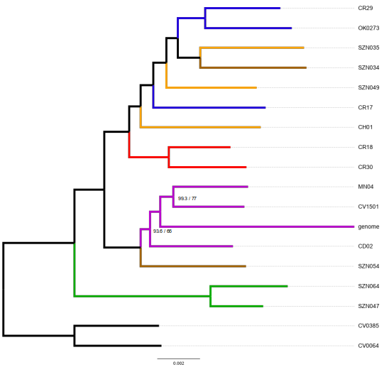

## Prepare the data
The OrthoFinder analysis identified 23,193 orthogroups, 4,038 of them containing all species. Among them, 2,867 were single copy.
You can download these orthogroups from the "01-Orthogroups", and then replicate my analyses with the following commands:

First, align all fasta files using MAFFT

    mkdir 02-MAFFT
    cp 01-Orthogroups/*fasta 02-MAFFT/
    cd 02-MAFFT/
    for f in *fasta
        do
        mafft $f > $f.mafft
    done
    rm *fasta
    cd ../

We used BMGE to clean these alignments. Ambiguously aligned positions are removed with default parameters. Additionally, we remove all sequences with more than 50% gaps and columns with more than 70% gaps (-g 0.5:0.7), and keep high-evolving sites (-h 1 -w 1).

    mkdir 03-BMGE
    cp 02-MAFFT/*mafft 03-BMGE
    cd 03-BMGE
    for i in *mafft
        do
        java -jar ./BMGE.jar -i $i -t DNA -g 0.5:0.7 -h 1 -w 1 -of $i.fas > $i.log
    done
    rm *mafft
    cd ../

**Check some alignments randomly to make sure everything looks fine**

I checked 10 alignments and they look fine to me. However, because BMGE removed sequences that were too short we need to filter the alignments that no longer have all the individuals.

    grep -c '>' 03-BMGE/*fas > ../grep.log 
    # it creates a list with the number of sequences per alignment. I use it to generate two files: BMGE_18sequences.txt, and BMGE_no_18sequences.txt

Move the 2,447 alignments that still have all individuals to a new folder.

    mkdir 04-BMGE_18sequences 04-BMGE_no_18sequences
    while IFS='' read -r LINE || [ -n "${LINE}" ]
        do
        cp 03-BMGE/${LINE} ./04-BMGE_18sequences/
    done < ./BMGE_18sequences.txt
    while IFS='' read -r LINE || [ -n "${LINE}" ]
        do
        cp 03-BMGE/${LINE} ./04-BMGE_no_18sequences/
    done < ./BMGE_no_18sequences.txt

Concatenate all alignments into a supermatrix

    mkdir 05-Supermatrix
    cp ./04-BMGE_18sequences/*fas 05-Supermatrix/
    cd 05-Supermatrix
    perl /home/saabalde/Escritorio/software/FASconCAT-G/FASconCAT-G_v1.05.pl -l -s -p > FASconCat.log
    rm *mafft.fas
    cd ../

We still have some cleaning to do, but let's make a tree to see how it looks like.

    mkdir 06-IQtree_preliminarytree/
    cp 05-Supermatrix/FcC_supermatrix_partition.txt 06-IQtree_preliminarytree/
    cp 05-Supermatrix/FcC_supermatrix.phy 06-IQtree_preliminarytree/
    cd 06-IQtree_preliminarytree/
    iqtree -s FcC_supermatrix.phy -spp FcC_supermatrix_partition.txt -m MFP -bb 1000 -alrt 1000 -nt AUTO
    cd ../

## Removing potential sources of systematic error
Working with phylogenomic datasets is not always as easy as that. Nuclear genes can have very dufferent evolutionary histories , and, as we are working with more than 2000, things can get messy. It is common practice to filter nuclear genes based on different properties, such as length, substitution rate, composition heterogeneity, among others.

Here, I am going to use the method described by Nicolas Mongiardino-Koch (2021, MBE). What does it do? It estimates seven commonly used gene properties (four sources of systematic bias: average pairwise patristic distance,  compositional heterogeneity, level of saturation, and root-to-tip variance; two proxies for phylogenetic signal: Robinson-Foulds similarity to a target topology and average bootstrap support; as well as the proportion of variable sites) and it calculates a PCA that measures the relation between phylogenetic signal vs systematic error.
Such method is described thoroughly [here](https://githubmemory.com/repo/mongiardino/genesortR).

    mkdir 07-Gene_filtering
    cd 07-Gene_filtering/
    
    # Infer a gene tree from each alignment
    mkdir 00-Genetrees 00-Supermatrix
    cp ../04-BMGE_18sequences/*fas ./00-Genetrees/
    cd 00-Genetrees/
    for i in *fas
        do
        iqtree -s $i -m MFP -AICc -bb 1000
    done
    
    # Among the 2247 alignments, 27 have 15 out of 18 identical sequences. IQ-TREE cannot infer the bootstrap support, so we need to remove them
    for i in OG0*.fas
        do
        seqs=$( ls $i.*treefile | grep -c 'OG000')
        if [ $seqs -lt 1 ]; then
            echo $i
            rm ${i}*
        fi
    done
    
    # Thus far, I know there are 25 genes that report an error during the genesortR run.
    rm OG0002067* OG0002102* OG0002386* OG0002595* OG0002657* OG0002677* OG0003002* OG0003247* OG0003436* OG0003641* \
       OG0003673* OG0003896* OG0004026* OG0004171* OG0004175* OG0004214* OG0004305* OG0004416* OG0004533* OG0004631* \
       OG0004653* OG0004679* OG0004715* OG0004765* OG0004780*
    
    # Create the list of trees
    cat *treefile > ../My_gene_trees.tre
    
    # Create a supermatrix with all these genes
    cp *fas ../00-Supermatrix
    cd ../00-Supermatrix
    perl /home/saabalde/Escritorio/software/FASconCAT-G/FASconCAT-G_v1.05.pl -l -s > FASconCat.log
    
    # Remove the "DNA, " from the beginning of each line in the partition file and copy these files to the working directory
    sed -i 's/^DNA\,\ //' FcC_supermatrix_partition.txt
    cp FcC_supermatrix* ../
    cd ../

This script also needs a rooted tree. I will use the tree I inferred before with IQ-TREE, but I collapse all the nodes in the ingroup to avoid any potential bias. When you have it, just run the genesortR.R script.

After removing 23 loci that were considered to be outlier, the script managed to find a correlation between the different properties calculated, which was used to sort the data: "The Principal Component Analyses 1 (PC1) is the one correlated and explains 19.62% of the variability observed." All gene properties can be found in the file "properties_sorted_dataset.csv". A summary of all these matrics can be found in the figure "sorted_figure.pdf". Based on these results, I run the script again to subsamble the best 500 genes ans trees.

## Symmetry tests
Thus far, we have aligned the sequences, cleaned unambiguously aligned positions from the alignments and selected the 500 genes that seem to suffer from less systematic bias. We are close to having a fully clean dataset. However, we still need to run one more cleaning step: symmetry tests.

Phylogenetic models rely on various simplifying assumptions to ease computations. If your data severely violate these assumptions, it might cause bias in phylogenetic estimates of tree topologies and other model parameters. Some common assumptions include:
- Treelikeness: all sites in the alignment have evolved under the same tree.
- Stationarity: nucleotide/amino acid frequencies remain constant over time.
- Reversibility: substitutions are equally likely in both directions.
- Homogeneity: substitution rates remain constant over time.

You can read the [IQ-TREE tutorial](http://www.iqtree.org/doc/Assessing-Phylogenetic-Assumptions) for more details.

    cd ../
    mkdir 08-Symmetry_and_homogeneity
    cp 07-Gene_filtering/sorted_alignment_500genes.fa 08-Symmetry_and_homogeneity/
    cp 07-Gene_filtering/sorted_alignment_500genes.txt 08-Symmetry_and_homogeneity/
    cd 08-Simmetry_and_homogeneity/
    iqtree2 -s sorted_alignment_500genes.fa -p sorted_alignment_500genes.txt --symtest-only
    cd ../
    # Make a list "Passing_genes.txt" with the genes that we'll use from now on.

The assumption of stationarity is rejected in 44 genes, whereas homogeneity is rejected in 17. In total, 63 genes have failed one of the two tests, although IQ-TREE only included 30 in the SymPval column. I will continue only with the genes that have past all tests: 437 genes.

    mkdir 09-Supermatrix_symmetry_pass 10-Gene_trees_symmetry_pass
    while IFS='' read -r LINE || [ -n "${LINE}" ]
        do
        echo ${LINE}
        cp ../04-BMGE_18sequences/${LINE}.fas ./09-Supermatrix_symmetry_pass/
        cp ../04-BMGE_18sequences/${LINE}.fas ./10-Gene_trees_symmetry_pass/
    done < ../08-Symmetry_and_homogeneity/Passing_genes.txt
    
    # Make the supermatrix
    cd 09-Supermatrix_symmetry_pass/
    perl /home/saabalde/Escritorio/software/FASconCAT-G/FASconCAT-G_v1.05.pl -l -s > FASconCat.log
    rm *mafft.fas
    
    # And infer the gene trees
    cd ../10-Gene_trees_symmetry_pass/
    for i in *fas
        do
        iqtree -s $i -m MFP -AICc
    done
    rm *fas
    cd ../

## Phylogenomic analyses

I will use two different approaches for the phylogenomic analyses. First, I will use IQ-TREE to analysed the concatenated dataset. I will let the program infer the best substitution model for each partition using the built-in ModelFinder algorithm.

    mkdir 11-IQtree_symmetry_pass/
    cp 09-Supermatrix_symmetry_pass/FcC_supermatrix* 11-IQtree_symmetry_pass/
    cd 11-IQtree_symmetry_pass/
    iqtree -s FcC_supermatrix.fas -spp FcC_supermatrix_partition.txt -m MFP -b 100 -alrt 1000 -bnni -T AUTO
    cd ../

Second, I use ASTRAL to infer the species tree under the multi-species coalescent model

    mkdir 12-ASTRAL_symmetry_pass
    cat ./10-Gene_trees_symmetry_pass/*treefile > My_gene_trees
    java -jar -Xmx12000M /home/saabalde/Escritorio/software/Astral/astral.5.7.7.jar -i My_gene_trees.tre -o Species_tree_ASTRAL.tre 2> ASTRAL.log

## This is the final tree inferred with IQ-TREE

All nodes have maximum statistic support unless otherwise specified.

---
