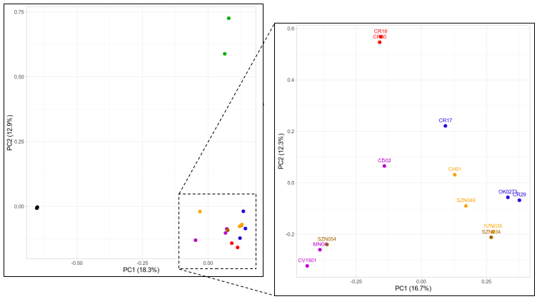

## Brief introduction
The recently published [high-quality genome of *L. ventricosus*](https://doi.org/10.1093/gigascience/giab037) was used as reference to map the raw sequencing data from all specimens with [BWA](http://bio-bwa.sourceforge.net/), variant calling was performed with [freebayes](https://github.com/freebayes/freebayes), and filtered with [VCFtools](https://vcftools.github.io/index.html) and [vcffilter](https://github.com/biopet/vcffilter).

Unfortunately, the input and intermediate files are too big to be shared here. Hence, I will just describe the steps necessary to replicate these analyses and share the R script used to plot the PCA.

The reference genome can be downloaded from [here](https://www.ncbi.nlm.nih.gov/genome/?term=conus+ventricosus). Links to raw reads were provided in [the main site](../README.md).

## Read mapping
Obviously, the raw reads from each specimen were mapped individually. Here I show how to do it with the sample CD02, but the same can be applied to all of them.

First, map the reads to the genome.

    # Extract the read group information
    header=$(zcat CD02.1.fastq.gz | head -n 1)
    id=$(echo $header | head -n 1 | cut -f 1-4 -d":" | sed 's/@//' | sed 's/:/_/g')
    sm=$(echo $header | head -n 1 | grep -Eo "[ATGCN]+$")
    echo "Read Group @RG\tID:$id\tSM:$id"_"$sm\tLB:$id"_"$sm\tPL:ILLUMINA"
    
    # Map the reads, adding this information to the sam file
    bwa mem -M -t 8 -v 3 -R $(echo "@RG\tID:$id\tSM:$id"_"$sm\tLB:$id"_"$sm\tPL:ILLUMINA") Lventricosus_reference_genome.fa CD02.1.fastq.gz CD02.2.fastq.gz > CD02_bwa.sam

Convert from sam to a sorted bam with [samtools](https://github.com/samtools/samtools).

    # Convert from sam to bam
    samtools view -S -b CD02_bwa.sam > CD02_bwa.bam
    
    # Sort the bam file
    samtools sort CD02_bwa.bam -o CD02_bwa.sorted.bam

Mark duplicate reads with [picard](https://broadinstitute.github.io/picard/).

    # Flag the duplicate reads
    java -jar picard.jar MarkDuplicates --INPUT CD02_bwa.sorted.bam --OUTPUT CD02.sorted.marked.bam --METRICS_FILE CD02.MarkedDuplicates_metrics.txt
    
    # Create an index
    samtools index CD02.sorted.marked.bam

## Variant calling and filtering
Variant calling was performed with freebayes, which also includes several quality filters. See the manual for further details on the specific parameters.

    # Create a file with the paths to all samples:
    ls *marked.bam > samples.txt
    
    # Run freebayes
    freebayes --bam-list samples.txt --vcf Lventricosus.vcf --fasta-reference Lventricosus_reference_genome.fa --standard-filters --min-coverage 4 --exclude-unobserved-genotypes --use-mapping-quality --genotype-qualities

115,797,225 variants were annotated. VCFtools and vcffilter were used to filter all low quality variants:

    # Filter 1: Remove variants missing in half of the samples. 37,734,979 sites (32.59%)
    vcftools --vcf Lventricosus.vcf --max-missing 0.5 --mac 3 --minQ 30 --recode --recode-INFO-all --out Lventricosus.filter1
    
    
    # Filter 2: Remove all variants with a less than three reads mapped. 37,734,979 sites (32.59%)
    vcftools --vcf Lventricosus.filter1.recode.vcf --minDP 3 --recode --recode-INFO-all --out Lventricosus.filter2
    
    
    # Filter 3: Remove variants not present in at least 14 out of 17 samples. 407,453 sites (0.35%)
    vcftools --vcf Lventricosus.filter2.recode.vcf --minDP 3 --recode --recode-INFO-all --out Lventricosus.filter3
    
    
    # Filter 4: Remove variants with an allele balance (AB) between 0.2 and 0.8, but keep homozygotic positions. E.g. AB = 0.8 means that one variant is supported by 80% of the reads. 254,877 sites (0.22%)
    vcffilter -s -f "AB > 0.20 & AB < 0.80 | AB < 0.01" Lventricosus.filter3.recode.vcf > Lventricosus.filter4.vcf
    
    
    # Filter 5: Remove all sites whose mapping quality differs between the reference allele and the variant allele (MQM / MQMR > 0.9 & MQM / MQMR < 1.05). The ratio between the two must be always around 1. 192,347 sites (0.17%)
    vcffilter -f "MQM / MQMR > 0.9 & MQM / MQMR < 1.05" Lventricosus.filter4.vcf > Lventricosus.filter5.vcf
    
    
    # Filter 6: Remove all sites called by reads whose pair did not map corcondantly. Remove the whole record, not only the specific allele. 184,492 sites (0.16%)
    vcffilter -f "PAIRED > 0.05 & PAIREDR > 0.05 & PAIREDR / PAIRED < 1.75 & PAIREDR / PAIRED > 0.25 | PAIRED < 0.05 & PAIREDR < 0.05" -s Lventricosus.filter5.vcf > Lventricosus.filter6.vcf
    
    
    # Filter 7: remove sites whose read depth was greater than the average depth plus a multiplier of 3 or 4 times the square root of average depth (depth-cutoff), and mapping quality was not twice this value. 169,625 sites (0.15%)
    # Create a list of the depth of each locus
    cut -f8 Lventricosus.filter6.vcf | grep -oe "DP=[0-9]*" | sed -s 's/DP=//g' > Lventricosus.filter6.DEPTH
    
    # Create a list of quality scores
    mawk '!/#/' Lventricosus.filter6.vcf | cut -f1,2,6 > Lventricosus.filter6.QUAL

    # Calculate the average depth (568.349)
    mawk '{ sum += $1; n++ } END { if (n > 0) print sum / n; }' Lventricosus.filter6.DEPTH
    
    # Mean depth plus three times the square root of the mean depth = 639,87
    # Combine the DEPTH and QUAL files, and find those loci whose depth is higher than 639 and the mapping quality is not two times the depth
    paste Lventricosus.filter6.QUAL Lventricosus.filter6.DEPTH | mawk -v x=639 '$4 > x' | mawk '$3 < 2 * $4' > Lventricosus.filter6.LOCI

    # Calculate the mean depth for each loci excluding these positions
    vcftools --vcf Lventricosus.filter6.vcf --site-depth --exclude-positions Lventricosus.filter6.LOCI --out Lventricosus.filter6.vcf
    
    # Make a table with this depth per site
    cut -f3 Lventricosus.filter6.ldepth > Lventricosus.filter6.site.depth
    
    # And calculate the average depth, considering we have 17 individuals
    mawk '!/D/' Lventricosus.filter6.site.depth | mawk -v x=17 '{print $1/x}' > Lventricosus.filter6.meandepthpersite

    # Sites that are extremely deep might represent paralogs or multicopy loci. Whatever it is, it is better to remove the fraction of sites with higher depth. After calculating different percentiles in R using the table "Lventricosus.filter6.meandepthpersite", it turns out 98% of the samples have a depth between 15 and 96.23. However, the next 1% goes up to 147.5, and those samples with greater depths have up to 1740.59. Based on this, we will remove all samples with a mean depth higher than 95

    # Combining both filters:
    vcftools --vcf Lventricosus.filter6.vcf --max-meanDP 95 --exclude-positions Lventricosus.filter6.LOCI --recode --recode-INFO-all --out Lventricosus.filter7

I know **Filter 7** can be confusing. For more details on this filter see [this](http://bcb.io/2014/05/12/wgs-trio-variant-evaluation/) **(this link is broken, trying to find an alternative)** and [this](https://academic.oup.com/bioinformatics/article/30/20/2843/2422145).

Finally, extract only the SNPs from the variants list and rename the samples (at the moment the read group information is used instead of the specimen ID).

    # Extract SNPs (156,774 sites)
    vcffilter -f "TYPE = snp" Lventricosus.filter7.recode.vcf > Lventricosus.filter7.snps.vcf
    
    # Rename the samples
    bcftools reheader Lventricosus.filter7.snps.vcf -s samples_names.txt > Lventricosus.filter7.snps.rename.vcf

Note that the samples name file is a two-column tab separated table with the read group information in column 1 and the sample ID in column 2:

    A00718_299_HTC5KDSXY_1_TAATACAG CD02

## SNP analysis: PCA
I used [Plink](https://www.cog-genomics.org/plink/) to run the PCA but, before that, it is important to remove the SNPs that are evolving under linkage disequilibrium. Plink will analyze the SNPs within a windows of 100,000 base pairs, with a sliding window stepsize 10, and a r2 threshold 0f 0.1.

    # Remove SNPs under linkage disequilibrium
    ./plink --vcf Lventricosus.filter7.snps.rename.vcf.gz --vcf-half-call reference --double-id --allow-extra-chr --set-missing-var-ids @:# --indep-pairwise 100 10 0.1 --out Lventricosus.snps.0-LD
    
    # Make a bed file and run the PCA
    ./plink --vcf Lventricosus.filter7.snps.rename.vcf.gz --vcf-half-call reference --double-id --allow-extra-chr --set-missing-var-ids @:# --extract Lventricosus.snps.0-LD.prune.in --make-bed --pca --out Lventricosus.snps.1-PCA

Three main groups were recovered in the PCA: the two outgroups, the two samples from the green clade, and all the rest. I will run this analysis again, with the same parameters, but excluding the two outgroups and the two green samples. Note that the "Exclude_samples.txt" file is just a list of the four samples ID's.

    # Exclude the four samples
    vcftools --gzvcf Lventricosus.filter7.snps.rename.vcf.gz --remove Exclude_samples.txt --recode --recode-INFO-all --out Lventricosus.filter7.snps.rename.subsample
    
    # Remove SNPs under linkage disequilibrium and make the PCA
    ./plink --vcf Lventricosus.filter7.snps.rename.subsample --vcf-half-call reference --double-id --allow-extra-chr --set-missing-var-ids @:# --indep-pairwise 100 10 0.1 --out Lventricosus.snps.2-LD_subset
    
    ./plink --vcf Lventricosus.filter7.snps.rename.subsample --vcf-half-call reference --double-id --allow-extra-chr --set-missing-var-ids @:# --extract Lventricosus.snps.2-LD_subset.prune.in --make-bed --pca --out Lventricosus.snps.3-PCA_subset

Run the **SNPs_PCA.R** R script to plot the PCA results.

## SNP analysis: Phylogenetics
Finally, I also used this SNP set to run a phylogenetic analyses. The two new tools are [vcf2phylip](https://github.com/edgardomortiz/vcf2phylip), to convert the vcf to a phylip alignments, and [IQ-TREE](http://www.iqtree.org/).

    # Convert the bed file to vcf
    ./plink --bfile Lventricosus_snps.noLD --allow-extra-chr --recode vcf --out Lventricosus_snps.noLD
    
    # Convert the vcf file to a phylip alignment. Do not allow missing data nor resolve ambiguities
    python vcf2phylip.py --input Lventricosus_snps.noLD.vcf.gz --min-samples-locus 17 --output-prefix Lventricosus_snps.noLD
    
    # Run IQ-TREE. Use ModelFinder to infer the best fit substitution model, but aply the ascertainment bias correction
    iqtree -s Lventricosus_snps.noLD.min17.phy -m MFP+ASC -b 1000 -alrt 1000 -nt AUTO
    rm *log *trees *gz
    iqtree -s Lventricosus_snps.noLD.min17.phy.varsites.phy -m MFP+ASC -b 1000 -alrt 1000 -nt AUTO

Note that IQ-TREE had to be run twice. Invariant sites are not allowed in the matrix, so the idea is to run IQ-TREE once, let it fail, and then use the new matrix that generated after removing the invariant sites to infer the tree.

## Can we see a pattern in the PCA?

Figure 4a.

---
