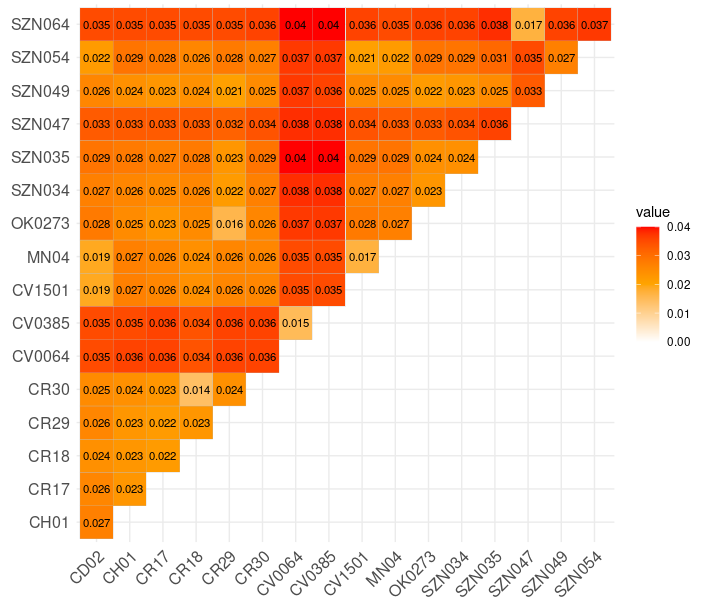

## Genomic distances: Skmer
Besides the pairwise distances between mitochondrial genomes, we also used [Skmer](https://github.com/shahab-sarmashghi/Skmer) to infer the distances at the genomic level. This analysis was done following [this tutorial](https://github.com/KamilSJaron/oh-know/wiki/Introduction-to-k-mers-for-analyzing-skimming-data). Briefly, Skmer first infers the Kmer spectra (default: Kmer = 21) from the raw sequencing data of all the specimens involved and, calculates the Jacard distance between pairs of specimens, and then transformes them (optional) to JC69 distances. Because the input and intermediate data of this analyses are too big, I just outline here how to outline the analysis. Then, I provide the R script I used to draw the correlation matrix shown in Figure 4 of the manuscript.

First, create a directory with all samples. If you are using raw sequencing reads, you should interleave them. Here, we used assembled genomes because the DNA quality of some of the samples was not so good, leading to overestimations of the kmer spectra.

    skmer reference -t ./input_data/
    skmer distance -t ./library/

This analysis generates a distance matrix called **ref-dist-mat.txt**, that I edited slightly to make my life easier while plotting the correlation matrix.

## This is how the matrix looks like:

---
